```{r,setup, include=FALSE}
knitr::opts_chunk$set(echo = FALSE, cache = FALSE, message=FALSE, 
                      warning = FALSE, fig.ext='png', dev = "png", dpi = 600,
                      fig.path = "images/", fig.align='center', fig.pos = "H",
                      out.width = "70%")

knitr::knit_hooks$set(mysize = function(before, options, envir) {
  if (before) 
    return(options$size)
})
```

# Infraestrutura de Dados Espaciais (IDE)

## A IDE

>- Desde a década de 90 cada país tem implementado uma IDE
>   + Argentina: [IDERA](https://www.idera.gob.ar/)
>   + Uruguay: [IDEuy](https://www.gub.uy/infraestructura-datos-espaciales/)
>   + Brasil: [INDE](https://www.inde.gov.br/)
>- Agenda 21 (UNCED)
>   + Em muitas áreas, a qualidade dos dados não é adequada
>   + Mesmo onde existem dados com qualidade, havia restrições de acesso
>   + Falta de padronização

## Objetivos de uma IDE

Segundo @INDE:

> - Compartilhar IG (informação geográfica);
> - Incrementar a administração eletrônica no setor público;
> - Garantir aos cidadãos os direitos de acesso à IG pública para a tomada de decisões;
> - Incorporar a IG produzida pela iniciativa privada;
> - Harmonizar a IG disponibilizada, bem como registrar as características dessa IG;
> - Subsidiar a tomada de decisões de forma mais eficiente e eficaz. 

## Componentes de uma IDE

```{r, fig.cap="Componentes de uma IDE. Fonte: \\textcite{IDEM}."}
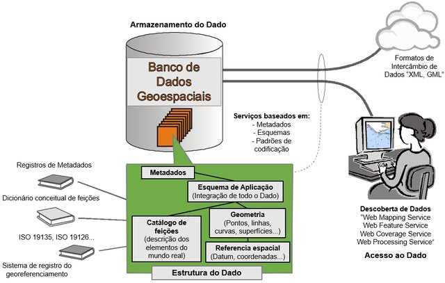
```

# Infraestrutura de Dados Espaciais no Brasil (INDE)

## A INDE

- Marco legal da INDE: Decreto 6.666/08

- Definição:

> conjunto integrado de tecnologias; políticas; mecanismos e procedimentos de
coordenação e monitoramento; padrões e acordos, necessário para facilitar e
ordenar a geração, o armazenamento, o acesso, o compartilhamento, a disseminação
e o uso dos dados geoespaciais de origem federal, estadual, distrital e
municipal [@INDE].

## Componentes da INDE

```{r}
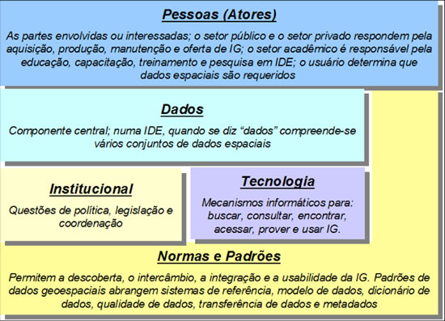
```

## INDEM?

>- \textcite{IDEM}

```{r, fig.cap="Organização temática (IDEM). Fonte: \\textcite{IDEM}."}
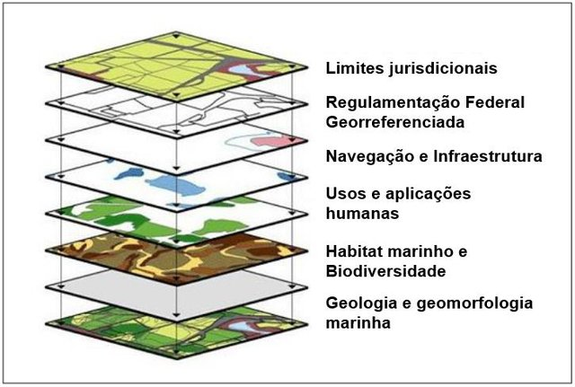
```

## Desafio SPU

```{r, fig.cap="Combinação entre sistemas terrestre e marinho. Fonte: \\textcite{IDEM}."}
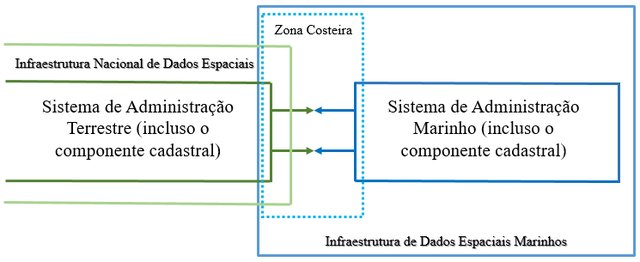
```

# Armazenamento de Informações Geográficas

# Sistemas de Referência

## A terra não é redonda

### Geóide

```{r, fig.cap = "Geóide.", out.width="65%"}
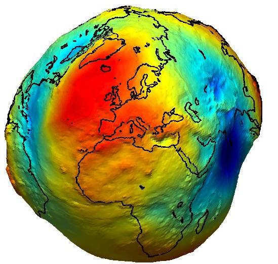
```

## A terra não é redonda

### Elipsóide

```{r, fig.cap="Parâmetros de um elipsóide."}
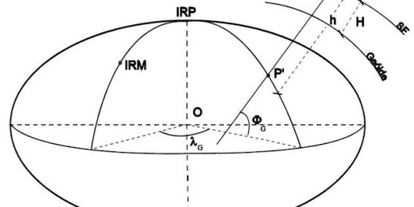
```

O elipsoide é uma superfície que tem um modelo muito mais simples que o geóide, 
e pode ser definida por um número bem menor de parâmetros.

## Sistemas de referência ou *datum* {.t}

>- Importância da adoção de um *datum*

```{r, fig.cap="Amarração entre as superfícies.", out.width="50%"}
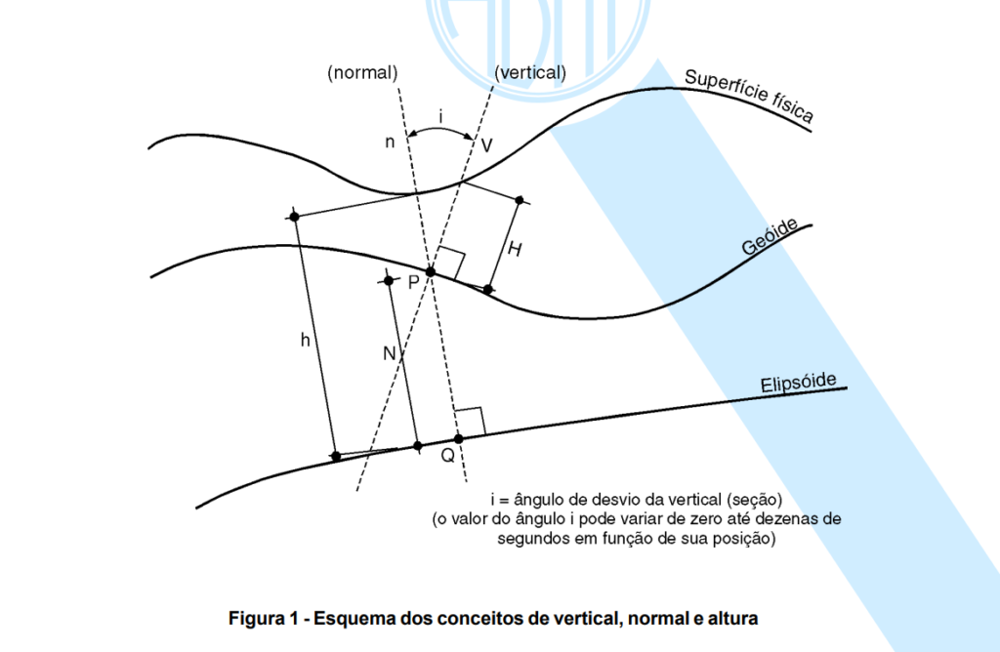
```

>- São compostos de:
>   + Um ponto de amarração
>   + Um norte (orientação)
>   + Um elipsóide

## Ilustração

```{r, fig.cap = "Sistemas de Referências global e local."}
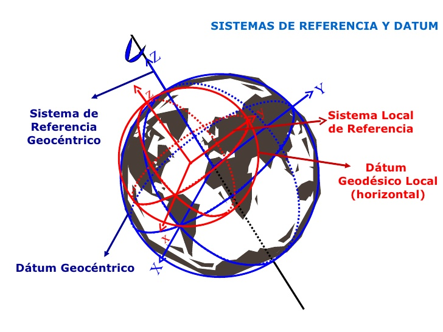
```

## SAD-69 vs. SIRGAS2000

```{r fig.cap = "Diferença entre o elipsóide do SIRGAS2000 e do SAD-69"}
knitr::include_graphics("images/sad-69-e-sirgas-WGS-84.jpeg")
```

# Projeções 

## Projeções {.plain}

```{r, out.width="100%", fig.cap = "Projeções cartográficas."}
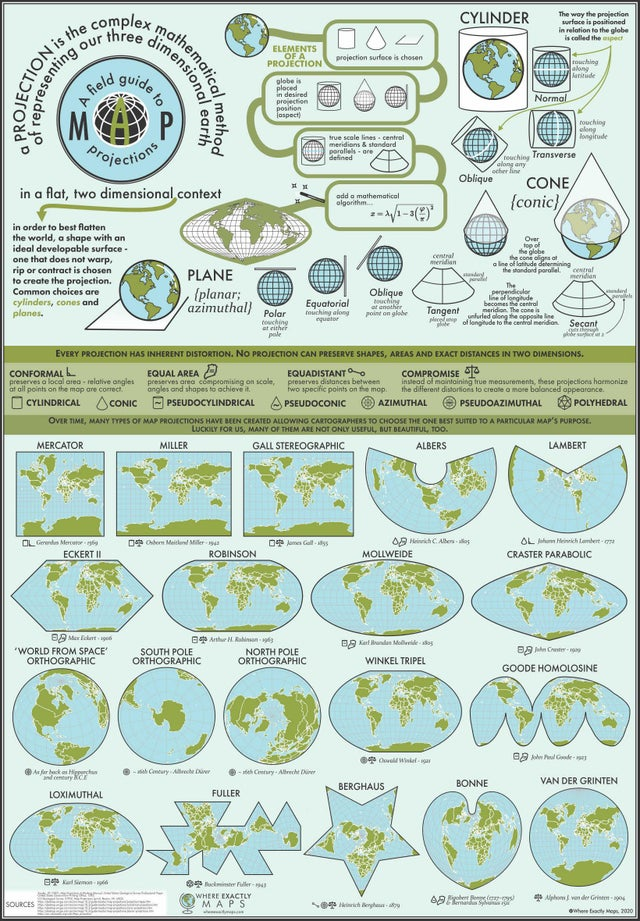
```

## Na prática

> - Código EPSG é atribuído a cada SRS.

> - Com as chegadas dos WebMapas 3D, projeções cartográficas praticamente
perdem o sentido.

> - Mesmo nos WebMapas 2D atuais, já existe um padrão, que é a utilização
da projeção Spherical Mercator ([EPSG:3857](http://epsg.io/3857)).

> - Os dados são armazenados *prioritariamente* em WGS-84 
([EPSG:4326](http://epsg.io/4326)), o padrão do formato *geojson*, que tem se 
consolidado como um dos formatos mais utilizados, devido ao avança dos webmapas.


# WebGIS

## Tecnologias

```{r, fig.cap = "Tecnologia para confecção de WebMapas."}
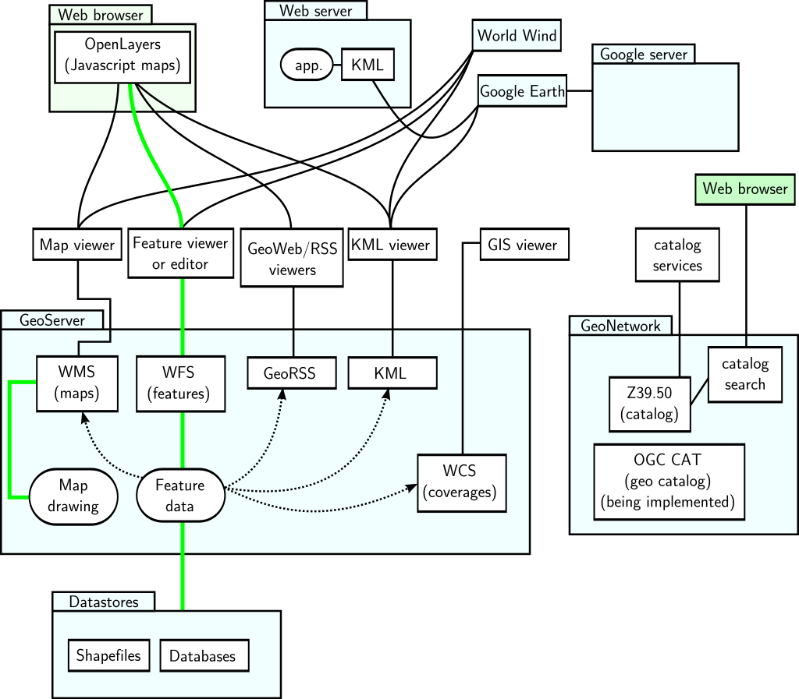
```


## Visualizadores de dados espaciais {.t}

>- Geovisualizadores
>   + [INDE](https://visualizador.inde.gov.br/)
>   + [IDERA](https://mapa.idera.gob.ar/)
>   + [IDEuy](https://www.gub.uy/infraestructura-datos-espaciales/publico/visualizador)
>   + [Chile (bens nacionais)](http://www.catastro.cl/)
>   + [IDECor](https://idecor.cba.gov.ar/)
>   + [IDE-SP](http://www.idesp.sp.gov.br/Visualizador)
>   + IDE-SPU?

# SPUViz

## SPUViz

```{r, fig.cap = "Modelo Conceitual - Atual", out.width="80%"}
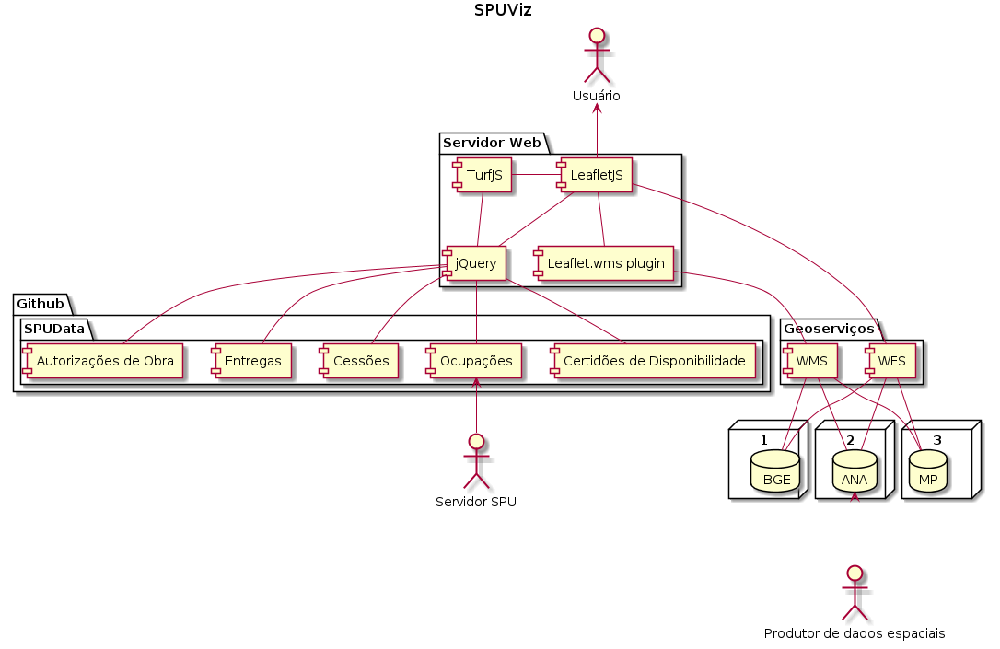
```

## SPUViz (futuro)

```{r, fig.cap = "Modelo Conceitual - Projetado", out.width="60%"}
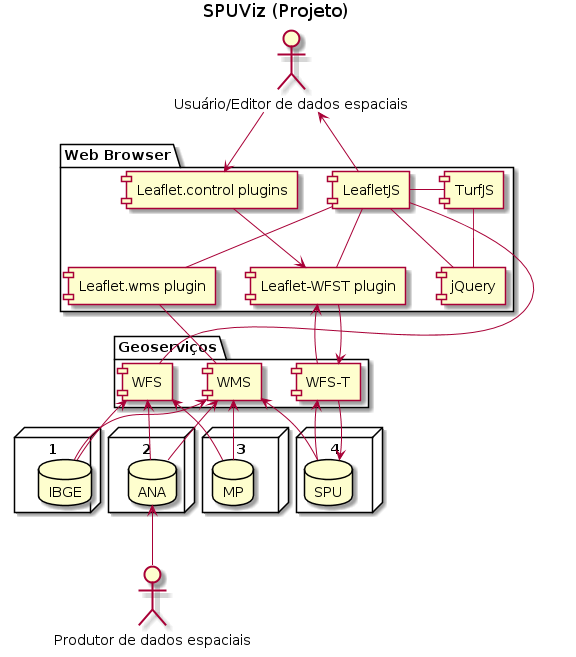
```

## Conclusão

\Huge\center \textsc\textbf{Obrigado!}

